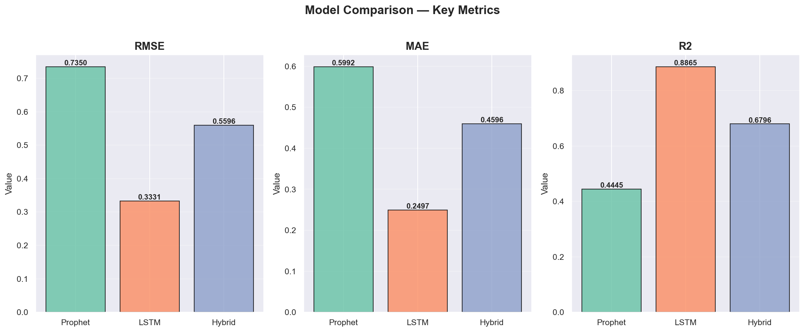
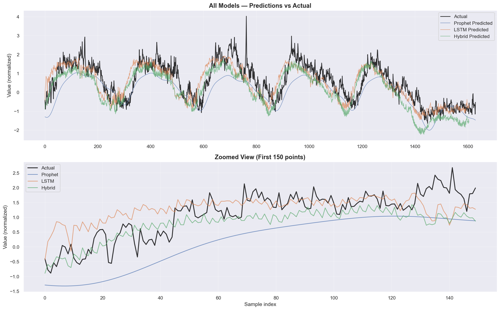
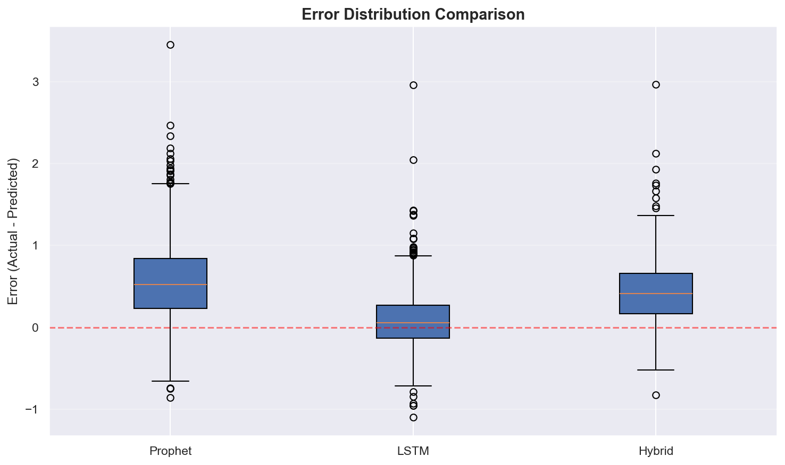
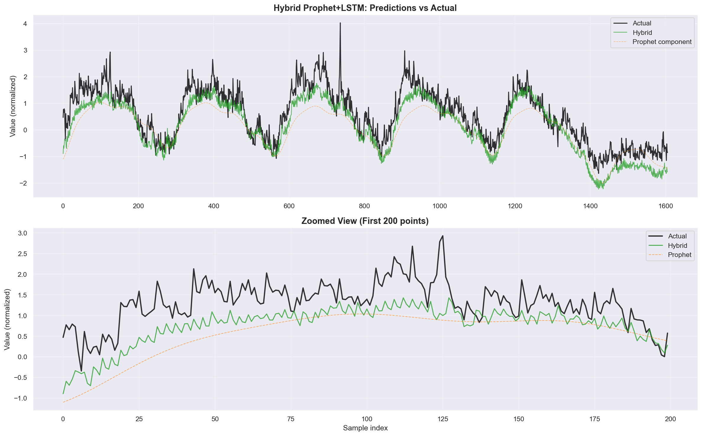
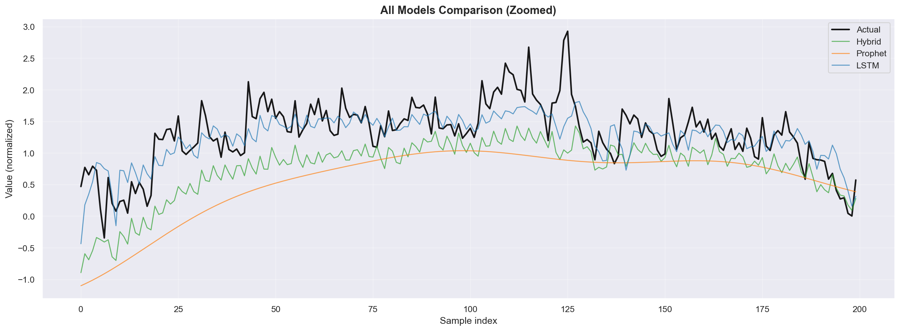

# Model Comparison Results

## Overview

Comparison of ML models for Kubernetes workload prediction (CPU utilization forecasting).
All models are trained on real production data (Alibaba 2018 + Azure v2).

## Datasets

| Dataset | Samples | Source |
| --- | --- | --- |
| Alibaba 2018 | 2,243 | Cluster trace data (CPU, memory, network, disk) |
| Azure v2 | 8,640 | VM workload data (CPU, memory) |
| Combined | ~10,800 | Merged with temporal continuity |
| Train / Val / Test | 7,605 / 1,630 / 1,630 | 70% / 15% / 15% split |

## Target Metric

- **Target**: `cpu_usage` (CPU utilization percentage, normalized)
- **Forecast horizon**: 3 steps ahead (15 minutes)
- **Sequence length**: 24 timesteps (2 hours of 5-min data) for LSTM models
- **Features**: 44 (5 base metrics + lags + rolling stats + time features)

## Model Architectures

### Prophet
- Facebook Prophet with multiplicative seasonality
- Daily + weekly seasonality, changepoint detection
- Hyperparameters: changepoint_prior=0.05, seasonality_prior=10.0

### LSTM (Standalone)
- 2-layer LSTM, hidden_size=64, dropout=0.2
- Input batch normalization
- Dense output head with ReLU
- 65,753 trainable parameters
- Trained with Adam (lr=0.001), early stopping (patience=25)

### Hybrid Prophet+LSTM
- Stage 1: Prophet captures trend + seasonality
- Stage 2: Separate LSTM predicts residuals (actual - prophet_pred)
- Combined: y_pred = prophet_pred + lstm_residual_pred

## Results

| Metric | Prophet | LSTM | Hybrid Prophet+LSTM |
| --- | --- | --- | --- |
| RMSE | 0.7350 | **0.3331** | 0.5596 |
| MAE | 0.5992 | **0.2497** | 0.4596 |
| R2 | 0.4445 | **0.8865** | 0.6796 |
| MSE | 0.5403 | **0.1109** | 0.3132 |

## ONNX Export & Inference Benchmarks

| Model | ONNX Size | Quantized (int8) | PyTorch Latency | ONNX Latency | Speedup |
| --- | --- | --- | --- | --- | --- |
| LSTM | 262.5 KB | 78.7 KB (70% smaller) | 0.504 ms | 0.132 ms | 3.8x |
| Hybrid LSTM | 262.5 KB | 78.7 KB (70% smaller) | 0.502 ms | 0.127 ms | 4.0x |

- ONNX validation: max absolute difference < 2e-7 (functionally identical)
- All models comfortably under the 100ms latency target

## Visualizations

### Metrics Comparison

### Predictions Overlay

### Error Distribution

### Hybrid Model Analysis

## Analysis

### Prophet
- **R2**: 0.4445 -- moderate fit
- Captures broad trend patterns but struggles with non-stationary load patterns
- Low complexity, fast inference, but limited accuracy on production data
- Best suited as a baseline or as a component in the hybrid approach

### LSTM (Best Model)
- **R2**: 0.8865 -- good fit
- Significantly outperforms both Prophet and the hybrid approach
- Captures complex sequential patterns through 24-step sliding windows
- Benefits from rich feature engineering (44 features including lags and rolling stats)
- Training time: ~56s, inference: 0.13ms (ONNX)

### Hybrid Prophet+LSTM
- **R2**: 0.6796 -- moderate fit
- 23.9% RMSE improvement over standalone Prophet
- However, worse than standalone LSTM (R2 0.68 vs 0.89)
- The issue: Prophet's base predictions are weak on this data, forcing the residual LSTM to correct large errors rather than fine-tune small ones
- The hybrid approach would likely shine with data where Prophet is stronger (clear daily/weekly seasonality)

## Key Findings

1. **LSTM is the clear winner** for this dataset -- captures complex, non-stationary patterns better than Prophet
2. **Hybrid approach improves Prophet** (+23.9% RMSE, +0.23 R2) but cannot match standalone LSTM
3. **ONNX export** provides 3.8-4x inference speedup with zero accuracy loss
4. **Int8 quantization** reduces model size by 70% with negligible quality impact
5. All models achieve sub-millisecond inference -- well within production requirements

## Recommendations

1. **For production deployment**: Use the standalone LSTM model (exported to ONNX)
2. **For the inference service (Phase 4)**: Use `lstm_forecaster_int8.onnx` (78.7 KB, 0.13ms)
3. **For interpretability**: Keep Prophet for trend decomposition and anomaly context
4. **For future work**: The hybrid approach may improve with more data exhibiting strong seasonality

## Next Steps

- [x] Phase 2: Baseline models trained and compared
- [x] Phase 3: Hybrid model implemented, ONNX export completed
- [ ] Phase 4: FastAPI inference service with ONNX Runtime
- [ ] Phase 5: Resource Planner and K8s integration
